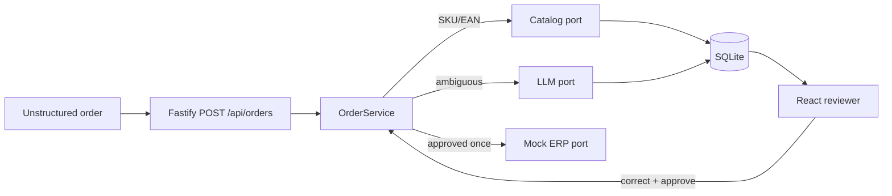

# Application and interview kit

## Skills matrix

| Capability | Evidence in this lab | Story to prepare |
| --- | --- | --- |
| Node/TypeScript | ESM workspace, Fastify, ports, strict Zod contracts | Why boundaries make change safer |
| Product thinking | one workflow, one KPI, reviewer-first design | What not to automate |
| AI engineering | JSON-only output, validation, provider adapter, safe failure | How you contain model uncertainty |
| Integrations | catalog and ERP ports, idempotency, retry-safe export | How you protect a messy system |
| Leadership | explicit trade-offs, exercises, operational metrics | How you align a team around outcomes |

## Technical drills

1. Design a retry strategy for a provider outage without duplicate exports.
2. Explain why exact SKU/EAN matching runs before an LLM and what happens when the catalog is stale.
3. Evolve SQLite persistence to a queue plus durable database while preserving the `OrderService` contract.
4. Threat-model prompt injection in an attached document and list controls.
5. Define SLOs: ingestion acceptance, review latency, export success, and correction rate.

## System-design prompt

“Design a multi-tenant order-intake system for 100k documents/day. Orders can arrive as email/PDF/CSV, the ERP may be slow or unavailable, and humans must retain control of uncertain lines.” Cover ingestion, object storage, extraction workers, catalog snapshots, confidence policy, review UI, idempotency, auditability, privacy, and rollout metrics. State what you would not build in the first six weeks.

## Two-minute demo script

“I chose one measurable workflow: reduce manual order retyping while keeping exceptions visible. Exact identifiers avoid model calls; descriptions are ranked and low confidence remains reviewable. The reviewer corrects one line, explicitly approves, and only then the mock ERP receives an idempotent export. A provider outage or malformed JSON becomes a failed, inspectable order. In production I would map the handler to an HTTP Lambda boundary and move persistence/retries to managed services, but I kept this lab offline and testable.”

## Product trade-off story

Use situation → decision → consequence → next experiment. Example: “We could auto-export high-confidence orders, but the cost of a wrong ERP order is higher than a review click. I required explicit approval, measured correction rate, and would relax policy only for a proven segment.”

## CV evidence checklist

- Name the outcome and KPI, not only technologies.
- Mention Node 24, TypeScript, Fastify, SQLite, React, Zod, Vitest, idempotency, and safe model boundaries.
- Include a link to a runnable demo/readme and one architecture diagram you can explain.
- Say explicitly that no real AWS account, customer data, or deployment was used.

## Application-story template

“I am applying because [problem/domain]. I bring [evidence]. In this lab I demonstrated [workflow/outcome], including [trade-off]. I would like to learn [unknown about RB2's current stack] and contribute by [specific first-month outcome].”

## Leadership scenarios

Prepare examples of: disagreeing on automation risk; helping a teammate through an unfamiliar TypeScript boundary; handling an integration incident; cutting scope to prove one KPI; and giving/receiving feedback across locations.

## Recruiter questions

- What does success in the first 90 days look like for the Lead Engineer?
- How is leadership split between people management, technical direction, and client/product decisions?
- Which Node/TypeScript, cloud, observability, and model-provider choices are current?
- How do teams decide that an AI pilot is safe to scale?
- What hybrid cadence and relocation support apply to Purmerend?

## Architecture diagram to explain in interview

The canonical project data flow is in [`docs/tutorial.md`](tutorial.md#outcome-and-architecture). Explain it as:

Be precise: this repository implements Fastify, SQLite, React, mock/provider adapters, and a local Lambda-shaped adapter. Queueing, object storage, managed secrets, API Gateway, and durable cloud databases are production mappings to discuss—not deployed components in this lab.
